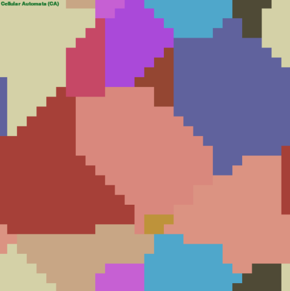
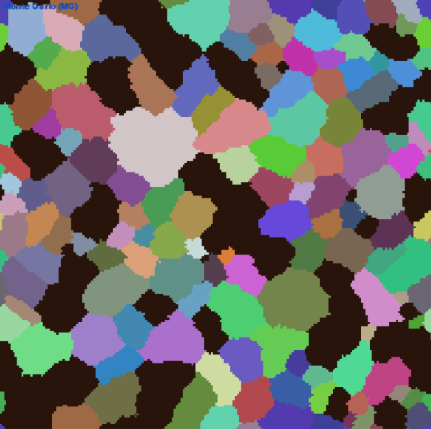
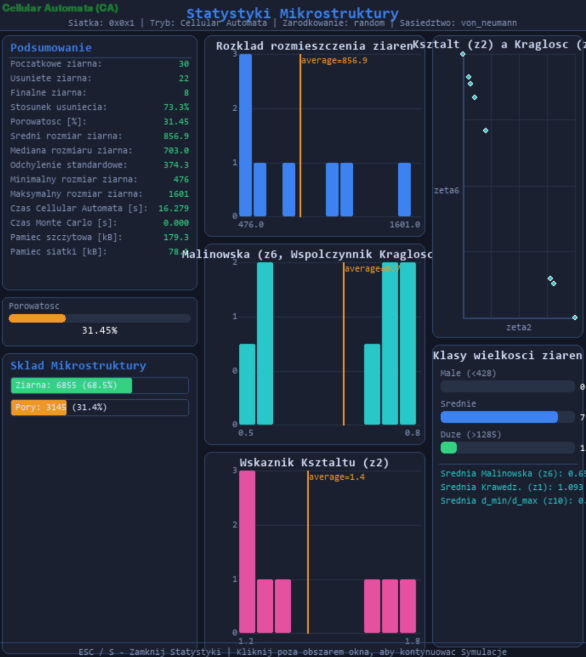

# 🔬 MultiscaleModeling — Rozrost Ziaren CA + Monte Carlo

> **PL** | Aplikacja do symulacji rozrostu ziaren materiałowych metodami automatów komórkowych (CA) i Monte Carlo (MC) — w przestrzeni 2D i 3D.
>
> **EN** | Grain growth simulation application using Cellular Automata (CA) and Monte Carlo (MC) methods — in 2D and 3D space.

---

## 🇵🇱 Opis projektu

Projekt implementuje **wieloskalowe modelowanie mikrostruktury materiałów** — zjawiska powszechnego w metalurgii i inżynierii materiałowej. Ziarno materiału to obszar spójnej orientacji krystalograficznej, a granice między ziarnami są miejscami o podwyższonej energii.

Symulacja przebiega w dwóch etapach:
1. **Cellular Automata (CA)** — szybkie wypełnienie przestrzeni zarodkami ziaren i ich rozrost według wybranych reguł sąsiedztwa.
2. **Monte Carlo (MC)** — energetyczna optymalizacja granic ziaren według kryterium Metropolisa: akceptacja zmiany stanu komórki zależy od zmiany energii `ΔE` i parametru temperatury `kT`.

Aplikacja obsługuje przestrzenie **2D i 3D**, eksport do formatu **OVITO**, wizualizację statystyk mikrostruktury oraz interaktywne ręczne rozmieszczanie zarodków.

## 🇬🇧 Project Description

The project implements **multiscale material microstructure modelling** — a phenomenon ubiquitous in metallurgy and materials engineering. A grain is a region of uniform crystallographic orientation, and grain boundaries are sites of elevated energy.

The simulation proceeds in two stages:
1. **Cellular Automata (CA)** — rapid seeding and growth of grains according to selected neighbourhood rules.
2. **Monte Carlo (MC)** — energy-driven grain boundary optimisation via the Metropolis criterion: a state-change is accepted based on energy change `ΔE` and temperature parameter `kT`.

The app supports **2D and 3D** grids, **OVITO** export, microstructure statistics, and interactive manual seeding.

---

## ✨ Funkcje / Features

| 🇵🇱 | 🇬🇧 |
|-----|-----|
| Symulacja CA w trybie 2D i 3D | CA simulation in 2D and 3D |
| Rozrost ziaren metodą Monte Carlo | Monte Carlo grain growth |
| 3 tryby zarodkowania: losowe, równomierne, ręczne | 3 seeding modes: random, uniform, manual |
| 4 typy sąsiedztwa (von Neumann, Moore, 5-kąt, 6-kąt) | 4 neighbourhood types |
| Warunki brzegowe: periodyczne lub pochłaniające | Boundary conditions: periodic or absorbing |
| Usuwanie ziaren (N losowych / % wypełnienia / klik) | Grain removal (N random / % fill / mouse click) |
| Scalanie i rozscalanie porów | Pore consolidation & deconsolidation |
| Wizualizacja 3D w osobnym oknie | 3D visualization in a separate window |
| Eksport do OVITO (porowatość, ziarna) | OVITO export (porosity, grains) |
| Panel statystyk mikrostruktury | Microstructure statistics panel |
| Zapis stanu do PNG | State export to PNG |

---

## 🧮 Model Monte Carlo / Monte Carlo Model

```
Energia granicy ziarna:
  E = J_gb × Σ (1 − δ(Sᵢ, Sⱼ))   dla sąsiadów j

Zmiana energii po próbie zmiany stanu:
  ΔE = E_po − E_przed

Akceptacja zmiany:
  ΔE ≤ 0  →  zawsze akceptuj
  ΔE > 0  →  akceptuj z p = exp(−ΔE / kT)

Parametry:
  J_gb  — energia granicy ziarna (domyślnie 1.0)
  kT    — temperatura (zakres 0.1 – 6.0)
```

---

## 🧱 Typy sąsiedztwa / Neighbourhood Types

```
von_neumann       →  4 kierunki (2D) / 6 kierunków (3D)
moore             →  8 kierunków (2D) / 26 kierunków (3D)
pentagonal_random →  losowy wzorzec 5-elementowy (2D)
hexagonal_random  →  losowy wzorzec 6-elementowy (2D)
```

---

## 🛠️ Technologie / Tech Stack


```
pygame      — główny interfejs graficzny, pętla zdarzeń
numpy       — siatka 3D i operacje wektorowe
PyOpenGL    — wizualizacja 3D (okno widoku przestrzennego)
datetime    — timestampy przy zapisie plików
```

---

## 🚀 Uruchomienie / Getting Started

### Wymagania / Requirements
```bash
pip install pygame numpy PyOpenGL PyOpenGL_accelerate
```

### Start
```bash
python main.py
```

Ustaw parametry w panelu bocznym (rozmiar siatki, liczbę zarodków, typ sąsiedztwa, tryb MC), kliknij **„Generuj przestrzeń"**, a następnie **„Start"**.

---

## 📁 Struktura projektu / Project Structure

```
MultiscaleModeling/
│
├── main.py                        # Główna pętla pygame, obsługa zdarzeń GUI / Main loop & GUI events
├── constants.py                   # Stałe: rozmiary okna, kolory, FPS / Window sizes, colors, FPS
├── grain_growth.py                # Algorytm CA — rozrost ziaren / CA grain growth algorithm
├── grain_growth_mc.py             # Algorytm MC — kryterium Metropolisa / MC Metropolis criterion
├── menu.py                        # Panel boczny z kontrolkami / Side panel with controls
├── ui_elements.py                 # Komponenty UI (przyciski, pola tekstowe) / UI components
├── view3d.py                      # Okno wizualizacji 3D (OpenGL) / 3D visualization window
├── microstructure_stats.py        # Obliczanie statystyk mikrostruktury / Microstructure statistics
├── stats_window.py                # Renderowanie panelu statystyk / Statistics panel rendering
└── ovito_export.py                # Eksport do formatu OVITO / OVITO format export
```

---

## 📊 Workflow

```
[Ustaw parametry]
       │
       ▼
[Generuj przestrzeń CA]  ──→  tryb ręczny: kliknij zarodki na siatce
       │
       ▼
[Start CA]  ──→  iteracyjny rozrost ziaren
       │
       ▼
[Opcjonalnie: Start MC]  ──→  optymalizacja granic ziaren
       │
       ▼
[Usuń ziarna / scal pory]  ──→  modelowanie porowatości
       │
       ▼
[Eksportuj PNG / OVITO / statystyki]
```

---

## 📸 Zrzuty ekranu / Screenshots

|  | 
| :---: |
| *Rysunek 1. Mikrostruktura CA: losowe zarodkowanie, von Neumann, periodyczne, 30 ziaren — typowa mikrostruktura polikrystaliczna, ziarna o niereguralnym kształcie* |
|  |
| *Rysunek 2. Odtworzona mikrostruktura stali dwufazowej: 200x200, 180 ziaren, Moore, Monte Carlo 50 kroków, porowatość około 25%* |
|  | 
| *Rysunek 3. Panel statystyk dla mikrostuktury* |

---

## 👩‍💻 Autorka / Author

**Julianna Wachowicz**
[github.com/JuliannaWach](https://github.com/JuliannaWach)